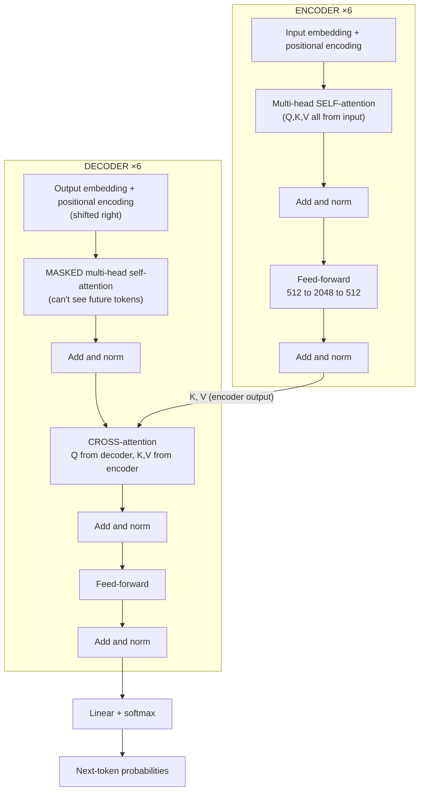

# Attention & The Transformer — A Ground-Up Guide

> Notes built from a step-by-step walkthrough of *Attention Is All You Need* (Vaswani et al., NeurIPS 2017).
> Goal: understand attention from the actual numbers up, not just the diagram.

---

## Table of contents

1. [The one-paragraph summary](#1-the-one-paragraph-summary)
2. [Why RNNs/LSTMs were the bottleneck](#2-why-rnnslstms-were-the-bottleneck)
3. [Words as vectors (the input)](#3-words-as-vectors-the-input)
4. [Q, K, V — what they really are](#4-q-k-v--what-they-really-are)
5. [The dimension story: 512, 64, and 8 heads](#5-the-dimension-story-512-64-and-8-heads)
6. [Matrices vs vectors vs scalars](#6-matrices-vs-vectors-vs-scalars)
7. [Fully worked example ("the cat sat")](#7-fully-worked-example-the-cat-sat)
8. [Why we scale by √dₖ](#8-why-we-scale-by-dₖ)
9. [Multi-head attention](#9-multi-head-attention)
10. [The three uses of attention](#10-the-three-uses-of-attention)
11. [The full architecture](#11-the-full-architecture)
12. [Model families: encoder-only, decoder-only, encoder-decoder](#12-model-families)
13. [Glossary](#13-glossary)

---

## 1. The one-paragraph summary

The Transformer throws away recurrence and convolution and relies **only on attention** to let tokens share information. The payoff is twofold: higher quality (28.4 BLEU on WMT14 EN-DE, 41.0 on EN-FR) and massive parallelism (the big model trained in 3.5 days on 8 P100 GPUs — a fraction of the compute of the RNN/conv models it beat). The core operation is **scaled dot-product attention**, run several times in parallel as **multi-head attention**.

---

## 2. Why RNNs/LSTMs were the bottleneck

In an RNN, hidden state `hₜ` depends on `hₜ₋₁`. So information from step 1 reaching step 50 must survive **49 sequential transformations** — it decays, and the steps can't be parallelized (each waits for the one before).

**LSTM** softens the decay with a separate **cell state** `C` — a near-untouched "conveyor belt" running across the top of the cell, regulated by three gates:

| Gate | Job |
|------|-----|
| Forget gate | multiplies `C` by ~0 (erase) or ~1 (keep) |
| Input gate | decides what new info to **add** to `C` |
| Output gate | decides how much of `C` to expose as `hₜ` |

Because `C`'s forward path is mostly *addition* and *multiply-by-~1* (not a full nonlinear squash every step), gradients flow back through it far better. This is the same "uninterrupted highway" idea as residual connections in ResNets and Transformer blocks.

**But** an LSTM is still sequential. The Transformer's move: let every token read every other token **directly, in one hop**, fully in parallel.

```
RNN/LSTM:   word1 → word2 → word3 → ... → word50   (50 hops, sequential)
Attention:  every word ──────────────────► every word   (1 hop, parallel)
```

---

## 3. Words as vectors (the input)

A model can't read letters. Each token becomes a list of numbers — a **vector** of length `d_model` (512 in the paper). This length is a **chosen knob**: bigger = more nuance per word, more compute. Nothing special about 512.

```
"cat" → [0.12, -0.4, 0.9, ... ]   ← 512 numbers (d_model)
```

Embeddings start **random** and are **learned** during training. Positional encodings are added so the model knows word order (since there's no recurrence to imply it).

---

## 4. Q, K, V — what they really are

For each word we produce **three** versions of it using three learned weight matrices:

```
word (512) ──► W_Q ──► Query  ("what I'm looking for")
word (512) ──► W_K ──► Key    ("what I contain / advertise")
word (512) ──► W_V ──► Value  ("what I hand over if picked")
```

### Key insight: nobody "assigns" the roles

The model has **no definition** of query/key/value. They are just three piles of numbers. The names are *human labels*. What makes one pile behave like a query is **where it sits in the equation**, not any built-in identity:

```
scores  = Q · Kᵀ          ← Q and K get compared (dot product)
weights = softmax(scores)
output  = weights · V      ← V gets averaged out at the end
```

- **Q and K** feed the **compare** slots → they're genuine *twins* (swapping them is a true symmetry).
- **V** feeds the **carry** slot → fundamentally different job (never enters the comparison).

The matrices start **random and different from each other** (never identical — identical matrices could never specialize). Training nudges each one, and because `W_Q`'s output always lands in the "compare-left" slot, the only way to reduce error is for `W_Q` to learn to ask good questions. **Structure decides the role; training fills in the content.**

> Free to swap names *before* training (just relabeling random matrices).
> Breaks if you rewire a *trained* model (each matrix has specialized).

---

## 5. The dimension story: 512, 64, and 8 heads

This is the part that confuses everyone. **512 and 64 are not magic.**

| Symbol | Value (paper) | Decided how? |
|--------|--------------|--------------|
| `d_model` | 512 | **Directly chosen** by authors (width of each word) |
| `h` (heads) | 8 | **Directly chosen** by authors |
| `d_k = d_v` | 64 | **Falls out:** `512 / 8 = 64` |

So `64` is **indirect** — it's what you get once you commit to 512 width split across 8 heads. The "real" dials are **512 and 8**; 64 is their consequence.

Why divide? Running 8 full-width (512) heads = 8× the work. Instead, split the budget so the heads *together* cost ~one full attention:

```
8 heads × 64 per head = 512   ← glue back to d_model at the end
```

```
word (512)
   │
   ├─ head 1: squeeze 512→64, do attention → 64-num result
   ├─ head 2: squeeze 512→64, do attention → 64-num result
   │   ... 8 heads ...
   └─ head 8: squeeze 512→64, do attention → 64-num result
   │
   └─► concat 8×64 = 512 ─► W_O ─► back to 512
```

**Two sizes, two jobs:** `d_model` (512) = width *outside* the head; `d_k`/`d_v` (64) = working width *inside* the head. The matrix `W_Q` is the bridge.

### Why W_Q is shaped 512 × 64

A weight matrix is a size-converter: **`[in × out]`**.

```
W_Q =  [ 512 × 64 ]
          │      │
        rows    columns
       (in:     (out:
       d_model)  d_k)
```

- **Rows = input size** → forced to match the word (512). One row per incoming number.
- **Columns = output size** → your choice, `d_k` (64). **Each column is the recipe for one output number.** 64 columns → 64 output numbers.

---

## 6. Matrices vs vectors vs scalars

A `d_k`-dimensional vector is a **flat list of plain numbers** — *not* a grid. "Dimension" = "how long the list is," like `[x, y, z]` but longer.

| Object | Shape | Type |
|--------|-------|------|
| `"sat"` as a word | 512 numbers in a line | **vector** |
| `W_Q` machine | 512 rows × 64 cols | **matrix** (grid) |
| `q_sat` (query) | 64 numbers in a line | **vector** |
| `q_sat · k_cat` | one number | **scalar** |
| all word-pair scores | n rows × n cols | **matrix** |

Two `d_k`-long vectors → dot product → **one scalar**. Stack all words' scores → an **n × n matrix** (one number per word-*pair*). The `n×n` score grid depends on **sentence length**, NOT on 64.

> `64` = how long each word's representation is.
> `n×n` = how many word-pairs there are.

---

## 7. Fully worked example ("the cat sat")

Tiny settings so every number is by hand: `d_model = 4`, **one head**, `d_k = d_v = 2`.

### Step 1 — embeddings (4 numbers each)
```
the = [1, 0, 1, 0]
cat = [0, 2, 0, 2]
sat = [2, 1, 0, 1]
```

### Step 2 — weight matrices (4×2 each, shared across all words)
```
W_Q =        W_K =        W_V =
[1, 0]       [0, 1]       [1, 0]
[0, 1]       [1, 0]       [1, 0]
[1, 0]       [0, 1]       [0, 1]
[0, 1]       [1, 0]       [0, 1]
```

### Step 3 — make Q, K, V (the 4→2 squeeze)
Example, "the" through W_Q:
```
q_the = 1·[1,0] + 0·[0,1] + 1·[1,0] + 0·[0,1] = [2, 0]   ← 4 numbers → 2
```
All words:
```
          Query        Key          Value
the   →   [2, 0]       [0, 2]       [1, 1]
cat   →   [0, 4]       [4, 0]       [2, 2]
sat   →   [2, 2]       [2, 2]       [3, 1]
```
(Note cat's q=[0,4] ≠ k=[4,0] — different machines, different readings of the same word.)

### Step 4 — dot products → score grid
sat's row (q_sat = [2,2]):
```
q_sat · k_the = 2·0 + 2·2 = 4
q_sat · k_cat = 2·4 + 2·0 = 8
q_sat · k_sat = 2·2 + 2·2 = 8
```
Full 3×3 score matrix:
```
           k_the  k_cat  k_sat
q_the   [    0      8      4   ]
q_cat   [    8      0      8   ]
q_sat   [    4      8      8   ]   ← sat's row
```

### Step 5 — scale by √dₖ (= √2 ≈ 1.414)
```
sat's row: [4, 8, 8] / 1.414 = [2.83, 5.66, 5.66]
```

### Step 6 — softmax sat's row
```
exp(2.83)=16.9, exp(5.66)=286.3, exp(5.66)=286.3   sum=589.5
weights → the: 0.029 (3%),  cat: 0.486 (49%),  sat: 0.486 (49%)
```

### Step 7 — weighted sum of Values → sat's output
```
z_sat = 0.029·[1,1] + 0.486·[2,2] + 0.486·[3,1]
slot1: 0.029 + 0.972 + 1.458 = 2.46
slot2: 0.029 + 0.972 + 0.486 = 1.49
z_sat = [2.46, 1.49]
```

**Result:** `sat` went in as `[2,1,0,1]` and came out as `[2.46, 1.49]` — a blend of *cat* and itself, reached in **one hop**.

### Matrix form (what's actually run)
Stack all queries into `Q` (3×2), all keys into `K` (3×2); `Q·Kᵀ` produces the entire 3×3 grid in **one** multiply. Then softmax each row, then `× V`. Same arithmetic, batched.

```
Q (n×dₖ) · Kᵀ (dₖ×n) → scores (n×n) → softmax → · V (n×dᵥ) → out (n×dᵥ)
```

---

## 8. Why we scale by √dₖ

**Problem:** a dot product sums `dₖ` terms, so longer vectors give bigger scores *just because they're longer*. If components are mean-0, variance-1, the dot product has **variance = dₖ**, i.e. typical spread ≈ `√dₖ`.

```
dₖ = 2   → spread ≈ 1.4
dₖ = 64  → spread ≈ 8
dₖ = 512 → spread ≈ 23
```

**Why that's bad:** softmax exponentiates. Big inputs make it **saturate** — one weight ≈ 1, the rest ≈ 0 — which (a) kills the *blend* attention is meant to do, and (b) flattens the gradient to ≈ 0, so the model **stops learning** the attention weights.

```
softmax([1,2,3])     ≈ [0.09, 0.24, 0.67]   ← soft, learnable
softmax([10,20,30])  ≈ [0.00, 0.00, 1.00]   ← saturated, dead gradient
```

**Fix:** divide scores by `√dₖ`. That's exactly the inflation factor, so it pulls variance back to **1** at any head size — soft softmax, healthy gradients.

> Caveat: "variance = dₖ" assumes independent mean-0/var-1 components — a *motivating approximation*, not a theorem about the trained net. It works empirically.

---

## 9. Multi-head attention

"8 heads" **is** multi-head attention: run the single-head mechanism above **8 times in parallel**, each with its own `(W_Q, W_K, W_V)`, so each head can learn a different relationship (subject–verb, adjacency, coreference, ...).

```
MultiHead(Q,K,V) = Concat(head₁, ..., head₈) · W_O
where headᵢ = Attention(Q·W_Qⁱ, K·W_Kⁱ, V·W_Vⁱ)
```

Each head outputs `dᵥ = 64`; concat 8×64 = 512; `W_O` (512×512) mixes them back into model width.

---

## 10. The three uses of attention

**Same mechanism every time. Only the source of Q, K, V changes.**

| Use | Q from | K, V from | Special rule |
|-----|--------|-----------|--------------|
| **1. Encoder self-attention** | input | input | none (sees all positions) |
| **2. Decoder masked self-attention** | output-so-far | output-so-far | future positions masked (−∞) |
| **3. Encoder–decoder cross-attention** | decoder (output) | encoder (input) | the bridge |

- **Q and K/V share a source → self-attention** (a sequence reading itself).
- **Q and K/V differ → cross-attention** (one sequence reading another).
- The **mask** in #2 blocks attention to future tokens (they don't exist yet during generation): set those scores to −∞ before softmax so they get 0 weight.

---

## 11. The full architecture



### ASCII fallback (if mermaid doesn't render)

```
            ENCODER (×6)                         DECODER (×6)
        ┌────────────────────┐             ┌──────────────────────────┐
input → │ embed + pos. enc.  │   output →  │ embed + pos. enc. (shift) │
        │         │          │             │            │             │
        │  ┌──────▼───────┐  │             │   ┌────────▼─────────┐    │
        │  │ self-attention│ │             │   │ MASKED self-attn │    │
        │  └──────┬───────┘  │             │   └────────┬─────────┘    │
        │     add & norm     │             │       add & norm         │
        │         │          │             │            │             │
        │  ┌──────▼───────┐  │   K,V       │   ┌────────▼─────────┐    │
        │  │ feed-forward │  │ ──────────► │   │  CROSS-attention │    │
        │  └──────┬───────┘  │  (encoder   │   │ Q=decoder        │    │
        │     add & norm     │   output)   │   │ K,V=encoder      │    │
        └─────────┬──────────┘             │   └────────┬─────────┘    │
                  │                        │       add & norm         │
                  └────────────────────────┤            │             │
                                           │   ┌────────▼─────────┐    │
                                           │   │  feed-forward    │    │
                                           │   └────────┬─────────┘    │
                                           │       add & norm         │
                                           └────────────┬─────────────┘
                                                        │
                                                 linear + softmax
                                                        │
                                              next-token probabilities
```

Every sub-layer is wrapped as `LayerNorm(x + Sublayer(x))` — the residual "+x" is the gradient highway (same idea as the LSTM cell state). `d_model = 512` throughout so the residual add lines up.

---

## 12. Model families

The paper's 3-way design got split into branches. Which of the three attention uses each keeps:

| Family | Example | Keeps | Good at |
|--------|---------|-------|---------|
| **Encoder-only** | BERT | unmasked self-attn (#1) | *understanding* (classification, search) — can't generate |
| **Decoder-only** | GPT, Claude, ChatGPT | **masked self-attn (#2) only** | *generating* — one stream, next-token prediction |
| **Encoder-decoder** | T5, original Transformer | all three (incl. cross-attn) | seq-to-seq (translation, summarization) |

### Why chat models are decoder-only

A chat has **no two separate sequences** to bridge — it's **one growing stream**: `[your msg][my reply][your msg]...`. Nothing to *cross* to ⇒ no cross-attention ⇒ no encoder needed. The model just does **masked self-attention** over one sequence: each token attends to all earlier tokens (your whole conversation + words generated so far), never forward. That backward-only masking is exactly what lets it generate one token at a time.

> So a chat assistant talking to you is **not** using cross-attention or an encoder — it's masked self-attention only. Cross-attention is real but lives in translation/T5-style models.

---

## 13. Glossary

| Term | Meaning |
|------|---------|
| **token** | a word/sub-word unit fed to the model |
| **embedding** | learned vector representation of a token (length `d_model`) |
| **d_model** | width of each token vector (512 in paper) — *chosen* |
| **h** | number of attention heads (8) — *chosen* |
| **dₖ, dᵥ** | per-head query/key and value size (`d_model / h` = 64) — *derived* |
| **Q, K, V** | query/key/value vectors, made by `W_Q/W_K/W_V` from the token |
| **scaled dot-product attention** | `softmax(Q·Kᵀ / √dₖ) · V` |
| **multi-head attention** | `h` parallel attentions, concatenated then mixed by `W_O` |
| **self-attention** | Q, K, V from the same sequence |
| **cross-attention** | Q from one sequence, K/V from another |
| **masking** | setting future scores to −∞ so they get 0 weight |
| **positional encoding** | added to embeddings to inject word-order info |
| **residual + LayerNorm** | `LayerNorm(x + Sublayer(x))`, the gradient highway |
| **BLEU** | n-gram-overlap translation metric (0–100, higher better); only comparable within the same test set |

---

*Reference: Vaswani, Shazeer, Parmar, Uszkoreit, Jones, Gomez, Kaiser, Polosukhin. "Attention Is All You Need." NeurIPS 2017.*
