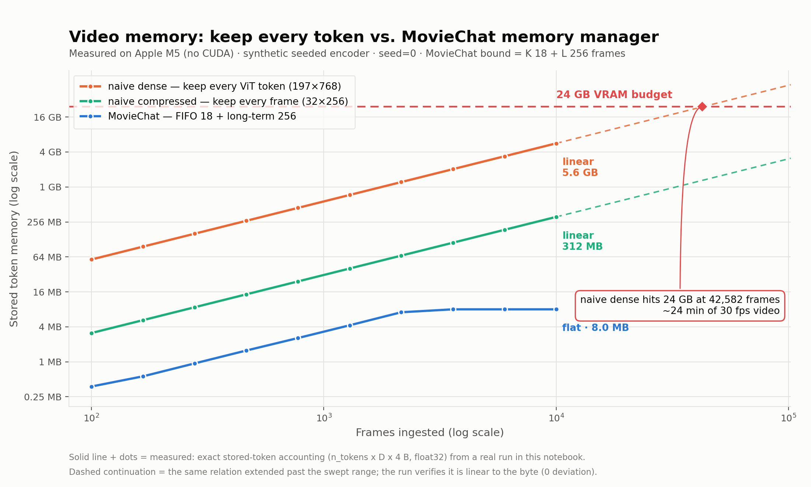
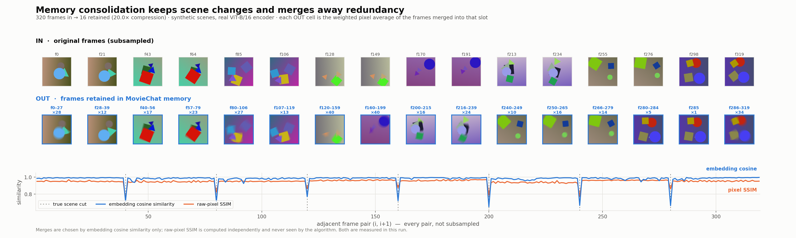

# MovieChat memory, reproduced

A minimal, runnable reproduction of the core memory-efficiency claim of
**MovieChat: From Dense Token to Sparse Memory for Long Video Understanding**
([arXiv:2307.16449](https://arxiv.org/abs/2307.16449)).

The claim: a video pipeline that keeps every frame's tokens grows linearly and
runs out of VRAM on long videos, while MovieChat's short-term FIFO plus
consolidated long-term memory stays **flat regardless of video length** — using
a parameter-free, training-free merge rule.

Two experiments test that. Every number below came out of a run in this repo.

---

## Setup

Requires [uv](https://docs.astral.sh/uv/). Nothing else — `uv` fetches Python 3.11
and the pinned deps.

```bash
uv sync
```

Runs on Apple Silicon (MPS) or CPU; CUDA is used if present but not required.
Experiment 2 downloads pretrained ViT-B/16 weights from the HF hub on first run
(add `--no-pretrained` to run fully offline).

## Run it

Everything lives in **[`MovieChat_repro.ipynb`](MovieChat_repro.ipynb)** — implementation,
both experiments, both figures, with the narrative. It ships executed, so the outputs
below are visible without running anything.

```bash
uv run jupyter lab MovieChat_repro.ipynb     # ~30 s to run all cells
```

To use your own footage, set `VIDEO_PATH = "clip.mp4"` in §7 and re-run from there.

Figures are written to `figures/`, raw numbers to `results/*.json`. `SEED = 0` is set
once at the top; the notebook is deterministic and reproduces every number below
bit-for-bit on re-run.

---

## Experiment 1 — memory scaling



Three pipelines, same synthetic frame stream, frame counts log-spaced 100 → 10,000:

| pipeline | per frame | behaviour |
|---|---|---|
| **naive dense** | 197 × 768 (full ViT-B/16 patch grid) = 591 KiB | keeps everything |
| **naive compressed** | 32 × 256 = 32 KiB | keeps everything |
| **MovieChat** | 32 × 256 | FIFO 18 + long-term 256, consolidated |

The second baseline matters: it gives the naive pipeline *MovieChat's own*
per-frame footprint, so the flat line is credited to the memory **manager**, not
to the token bottleneck. Both effects are real and they are shown separately.

### Measured (`results/scaling.json`)

| N frames | naive dense | naive compressed | MovieChat | MC frames | dense ÷ MC |
|---:|---:|---:|---:|---:|---:|
| 100 | 57.7 MB | 3.1 MB | 0.38 MB | 12 | 154× |
| 464 | 267.8 MB | 14.5 MB | 1.56 MB | 50 | 171× |
| 1,292 | 745.7 MB | 40.4 MB | 4.25 MB | 136 | 176× |
| 2,154 | 1,243.2 MB | 67.3 MB | 7.12 MB | 228 | 175× |
| **3,594** | 2,074.3 MB | 112.3 MB | **8.00 MB** | **256** | 259× |
| 5,995 | 3,460.0 MB | 187.3 MB | **8.00 MB** | **256** | 433× |
| 10,000 | 5,771.5 MB | 312.5 MB | **8.00 MB** | **256** | **721×** |

MovieChat saturates at **8.00 MB / 256 frames** by ~3,600 frames and does not
move after that. The two naive lines never stop growing.

**24 GB crossing.** naive dense reaches a 24 GB budget at **42,582 frames**
(~24 min of 30 fps video); naive compressed at 786,432 frames. MovieChat cannot
cross it — its hard bound is `K + L_cap = 18 + 256 = 274` frames = **8.56 MB**.

### Integrity checks (printed by the script)

- MovieChat's byte accounting equals the real allocated tensor bytes at every N — **PASS**
- naive dense is linear in N to the byte — **max deviation 0 bytes**
- MovieChat stored frames never exceed `K + L_cap = 274` — **PASS** (max observed 256)

---

## Experiment 2 — does it merge the *right* frames?



320 frames with 8 distinct scenes (40 frames each), encoded frame-by-frame by a
**pretrained timm ViT-B/16**, then pushed through the memory manager.

- **320 frames in → 16 retained. 20.0× compression**, 10.00 MB → 0.50 MB.
- 17 consolidations, 9 long-term compactions, 304 merge operations.
- **0 of 16** retained slots mix frames from more than one scene.
- **8 of 8** scenes are still represented in memory.

Two independent similarity signals, measured over all 319 adjacent pairs:

| | within a scene | across a cut | separation |
|---|---:|---:|---:|
| embedding cosine (what the merge rule uses) | 0.9860 | 0.7009 | **0.285** |
| raw-pixel SSIM (never seen by the algorithm) | 0.9528 | 0.8187 | 0.134 |

The algorithm only ever looks at embedding cosine. SSIM is computed
independently and agrees on where the cuts are — and the embeddings separate
scenes about twice as sharply as raw pixels do, which is why merging in token
space works. In the figure, the 7 dashed verticals are the true cuts; every one
lines up with a cosine dip, and no merged slot straddles one.

Each **OUT** cell is the size-weighted pixel average of the frames merged into
that slot — the pixel-space image of the token it holds. Within-scene motion
shows up as blur; no cell shows two scenes ghosted together.

---

## What's real, what's synthetic

Labelled explicitly because it's the difference between a demo and a result.

| | Experiment 1 | Experiment 2 |
|---|---|---|
| encoder | **synthetic** — seeded token tensors, no pixels, no network | **real** — pretrained timm ViT-B/16, 224×224, frame by frame |
| pixels | none | **synthetic** video (real pixels, generated content); `--video` for your own |
| memory manager | **real** — same code both experiments | **real** |
| memory numbers | **measured**, exact accounting | **measured**, exact accounting |

Experiment 1 uses the synthetic encoder so a 10,000-frame sweep runs in ~22 s.
The memory manager under test is identical in both.

### The three memory metrics, never mixed

1. **Stored token memory** (primary, on both plots) — `n_tokens × D × 4 B`,
   float32. Exact, deterministic, machine-independent. Verified against real
   allocated tensor bytes.
2. **CUDA `max_memory_allocated`** — real VRAM. This machine (Apple M5) has no
   CUDA device, so it is reported as `n/a`, never substituted for.
3. **Process RSS** — always labelled *"process RSS (not VRAM)"*. Includes the
   interpreter, torch and allocator slack; a sanity line only.

The 24 GB reference line is a **VRAM budget** for a typical 24 GB card, compared
against stored-token memory. Physical tensor allocation stops at a 2 GB guard
(`--max-materialize-gb`) because the host has 24 GB total — exact accounting
continues past it, and the run reports where that happened.

The dashed continuations past 10,000 frames on the plot are the same relation
extended arithmetically. That is legitimate only because the run *verifies* the
relation is linear to the byte (0 deviation); it is drawn dashed and captioned
so it is never mistaken for a measured point.

---

## Implementation notes

`MovieChatMemory` (notebook §4) implements the paper's Algorithm 1 directly:

```
while len(S) > R_L:
    s_i = sim(x_i, x_{i+1}) for all adjacent pairs   # Eq. 3
    m   = argmax(s)
    x_m = merge(x_m, x_{m+1});  del x_{m+1}
```

with Eq. 3's frame similarity — the mean over the N tokens of the per-token
cosine — and a ToMe-style size-weighted average as `merge`, so a frame standing
for 40 originals isn't outvoted by a fresh one. Similarities are cached and only
the two pairs adjoining a merge are recomputed. No parameters, no training.

**Two documented deviations from the paper**, both exposed as arguments:

- **Long-term cap.** The paper extends positional encodings rather than capping
  `L`. Capping is what makes memory provably flat, so `L` is capped
  (`long_term_frames`, default 256) and overflow re-runs the same merge over
  `L`. Experiment 2 lowers it to 16 because 256 would never bind on a 320-frame
  clip.
- **Short-term re-init.** Paper §3.3 re-initialises `S` with the consolidated
  feature so information crosses window boundaries. Default here clears `S`;
  `reinit_short_term=True` restores the paper's behaviour. It changes
  consolidation cadence, not the bound.

`QFormerSqueeze` (notebook §2) reproduces the *shape* of BLIP-2's Q-former
bottleneck (197×768 dense → 32×256 sparse), not its semantics: 32 fixed query
vectors cross-attend over real ViT patch tokens (so each output is a convex
combination of genuine pretrained features), then a fixed near-orthogonal random
projection, which approximately preserves cosine geometry. It is untrained, and
labelled as such in the code. The memory claim depends on the token-count
bottleneck, which is exact; frame-to-frame similarity structure survives the
squeeze, which is what Experiment 2 relies on and what its 0.285 cosine
separation demonstrates.

### Layout

```
MovieChat_repro.ipynb  the whole reproduction
  §1  measurement — the three memory metrics, kept separate
  §2  encoders — real ViT-B/16 + Q-former-shaped squeeze; seeded synthetic encoder
  §3  NaiveDenseMemory — keep everything
  §4  MovieChatMemory — Algorithm 1, FIFO + consolidated long-term
  §5  plot styling (validated colorblind-safe palette)
  §6  Experiment 1 — scaling
  §7  Experiment 2 — consolidation
  §8  save raw numbers
figures/               fig_memory_vs_frames.png, fig_consolidation_filmstrip.png
results/               scaling.json, consolidation.json
```

All paper defaults sit in the `CFG` dict in §6: `window=16, short_term_frames=18,
long_term_frames=256, consolidation_length=2, tokens_per_frame=32, dim=256`.

Environment: Apple M5, 24 GB unified memory, macOS 25.4, Python 3.11.15,
torch 2.5.1 (MPS), no CUDA.

---

## Takeaway (LinkedIn caption)

> Reproduced the core claim of MovieChat (arXiv:2307.16449) on a MacBook: a dense
> video pipeline that keeps every frame's tokens hits a 24 GB VRAM budget after
> 42,582 frames — about 24 minutes of 30 fps video. MovieChat's memory manager
> flatlines at 8 MB and never moves, no matter how long the video gets: 721× less
> at 10k frames.
>
> The trick is a fixed FIFO buffer plus a greedy merge of the most-similar
> adjacent frames — parameter-free, training-free, ~200 lines. On 320 frames
> across 8 scenes it compressed 20× while merging exactly zero pairs across a
> scene cut, and kept all 8 scenes.
>
> Long-video understanding wasn't blocked on a bigger context window. It was
> blocked on nobody throwing away the redundant frames.
