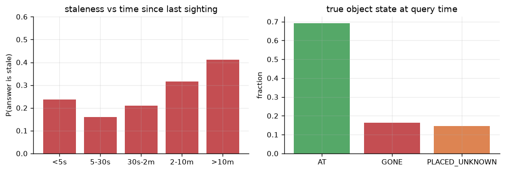
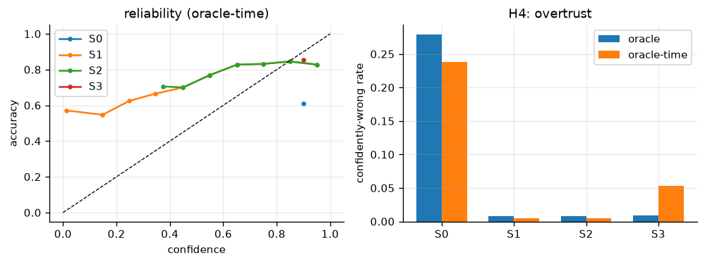
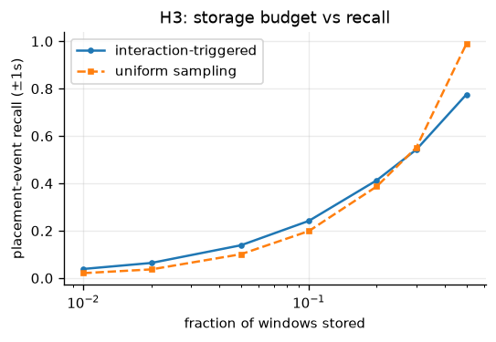

# VoxSight Recall — results

Generated by `../voxsight_recall.ipynb` (49 cells, runs top-to-bottom in ~100 s once features are
cached). Hypotheses and schema: `../problem_statement.md`.

**Run config:** EPIC-KITCHENS-100 · annotation stages over all 76,885 narration rows / 633 videos /
34 participants · perception stages over 11 videos / 9 participants (~4 h egocentric video, 20 GB
frames) · frozen CLIP ViT-B/16 @ 3 fps · event head 1.47 M trainable params · MPS · seed 0.

Splits are **by participant**: train P01/P02/P03/P12/P06, val P23/P11, test P04/P30.
Evaluation is 26,260 held-out test queries.

| | verdict |
|---|---|
| **H1** last-seen ≠ current | **CONFIRMED**, large and robust |
| **H2(a)** decay-as-retention | **CONFIRMED** — actively harmful, no setting helps |
| **H2(b)** decay-as-confidence | **CONFIRMED** — time is near-chance, contradiction is not |
| **H4** overtrust / calibration | **CONFIRMED**, with a twist |
| **H3** event selection under budget | **NOT ESTABLISHED** — see §8 |

---

## 1. The event stream

| | count |
|---|---|
| narration rows | 76,885 |
| state events extracted | 37,424 |
| — TAKE (`take`, `remove`, `move`) | 19,866 |
| — PUT (`put`, `insert`) | 17,558 |
| — PUT **naming a receptacle** | 5,423 (30.9% of PUTs) |
| queries generated | 173,624 across 451 videos |

The last row is not part of any hypothesis and is the most immediately useful thing here: **only 31%
of placements say where the object went.** A bare *"put down plate"* records that an object moved
without recording where to. A schema with a location field and no way to write "placed, location
unobserved" must either discard these or invent a location.

---

## 2. H1 — last-seen vs where it is now — **CONFIRMED**

Full corpus, oracle perception:

| | |
|---|---|
| S0 (last-occurrence) answer correct | **69.1%** |
| S0 answer **stale** | **30.9%** |

| true state at query time | share |
|---|---|
| `AT(r)` — still there | 69.1% |
| `GONE` — taken/moved since | 16.2% |
| `PLACED_UNKNOWN` — put down since, receptacle unobserved | 14.6% |

The comparison that matters:

| level | score |
|---|---|
| Recall@1 of the grounding event | **100.0%** |
| current-location accuracy | **69.1%** |
| gap invisible to Recall@K | **30.9%** |

Retrieval here is not merely good, it is *perfect* — object identity is exact, there is no embedding
to get wrong, so the retriever always returns the correct past event. The answer built on that
perfect retrieval is wrong about the present almost a third of the time.

**The failure is not a retrieval failure and cannot be fixed by a better retriever.** The
information needed is not in the retrieved event; it is in the events that came *after* it, which a
last-occurrence system never consults. A benchmark reporting Recall@K on this task would print
100% while the assistant misdirects a user on 3 queries in 10.

On the held-out test split specifically, S0 scores **0.721** and the state-aware S3 scores **0.991**.

### 2.1 Is this an artefact of my labelling choices?

Four judgement calls go into the query set. Each was varied:

| variant | queries | stale |
|---|---:|---:|
| baseline (as reported) | 173,624 | **30.9%** |
| `move` NOT an invalidation | 164,373 | 28.8% |
| receptacle = LAST other noun | 173,624 | 30.9% |
| 1 query / object / 60 s | 22,718 | 28.7% |
| strictest: no-move + 60 s cap | 22,552 | **27.0%** |

Dropping `move` — the most arguable call, since *"move the pan on the hob"* may relocate nothing —
costs 2.1 points. The receptacle rule is exactly neutral. Capping query frequency shrinks the set 7×
and still leaves 28.7%, so the number is not an artefact of over-querying long-lived objects. Every
conservative choice stacked together still leaves **27.0%**.

Because unnarrated pickups can only make a stale answer look correct, **27–31% is a lower bound.**

---

## 3. Perception — the event head, and the bottleneck

Small temporal transformer over frozen CLIP features, ±2.7 s window, 1.47 M params. Input is the
feature sequence concatenated with its temporal difference: PUT and TAKE are the same scene
traversed in opposite directions, so a static per-frame descriptor cannot separate them.

Validation (P23, P11), best of 40 epochs by macro-F1:

| class | precision | recall | F1 | support |
|---|---|---|---|---|
| none | 0.700 | 0.418 | 0.523 | 524 |
| PUT | 0.295 | 0.414 | 0.345 | 244 |
| TAKE | 0.356 | 0.500 | 0.416 | 280 |
| **macro** | 0.450 | 0.444 | **0.428** | 1048 |

| auxiliary head | score |
|---|---|
| object top-1 on event windows | 0.153 (chance 0.032) |
| receptacle top-1 on PUT windows | 0.848 — **inflated**, majority-class rate is 0.889 |
| receptacle top-1 on PUTs *naming* a receptacle | **0.000** (n=27) |

> **Read the receptacle row carefully.** 69% of PUTs name no receptacle and all carry the same
> `other` label, so a model that always predicts `other` already scores ~0.89. Restricted to the
> PUTs that actually name a place — the only ones that can ground an answer — the head gets **none
> of them right**, on a validation set containing just 27 such windows. The receptacle task is
> data-starved, not merely hard.

This bounds everything downstream, and it is why the three-arm design exists.

---

## 4. H1 under real perception — three arms

| arm | event times & objects | PUT vs TAKE | isolates |
|---|---|---|---|
| oracle | narrations | narrations | the memory policy alone |
| oracle-time | narrations | predicted | the contradiction signal itself |
| learned | detected | predicted | end-to-end reality |

Current-state accuracy on 26,260 test queries:

| system | learned | oracle | oracle-time |
|---|---|---|---|
| S0 last-occurrence | 0.226 | 0.721 | 0.473 |
| S1 + Ebbinghaus confidence | 0.226 | 0.721 | 0.473 |
| S2 + Ebbinghaus retention | 0.275 | 0.423 | 0.347 |
| **S3 state-aware** | 0.275 | **0.991** | **0.538** |

Assertion rate — how often the system commits to a location at all:

| system | learned | oracle | oracle-time |
|---|---|---|---|
| S0 / S1 | 0.120 | 1.000 | 0.615 |
| S2 | 0.015 | 0.213 | 0.110 |
| S3 | 0.028 | 0.729 | 0.363 |

Because the learned arm depends on a trained head whose numbers move between seeds, the
`oracle-time` results are reported as **mean ± sd over 3 seeds**:

| metric | mean ± sd |
|---|---|
| event-head macro-F1 | 0.437 ± 0.008 |
| S0 accuracy | 0.444 ± 0.046 |
| **S3 accuracy** | **0.493 ± 0.056** |
| S0 confidently-wrong | 0.227 ± 0.044 |
| **S3 confidently-wrong** | **0.052 ± 0.002** |
| S3 ECE | 0.070 ± 0.036 |
| query coverage | 0.544 ± 0.065 |

S3 beats S0 on **every individual seed** (+0.064, +0.043, +0.039; mean **+0.049**), so the
state-aware policy pays even when the contradiction signal comes from a weak detector.

> **The fully-learned arm does not work, and its accuracy number is misleading.** It asserts a
> location on 2.8–12% of queries because the receptacle head almost never emits a usable place. Its
> 0.226–0.275 "accuracy" is therefore earned almost entirely by *failing to answer* — abstention
> counts as correct whenever the object really has moved. It is reported for completeness, not as
> evidence for anything.

---

## 5. H2(a) — decay as *retention* — **CONFIRMED, and it is worse than neutral**

S2 implements MemoryBank's forgetting as specified: an event whose Ebbinghaus strength
`exp(-Δt/S)` falls below a threshold is dropped.

| oracle arm | accuracy | asserts |
|---|---|---|
| S1 (decay → confidence) | 0.721 | 100.0% |
| S2 (decay → retention) | **0.423** | **21.3%** |

**78.7% of queries became unanswerable purely from forgetting, and accuracy fell 29.7 points.**

Is there a better decay constant? No — the sweep is monotonic in the direction of forgetting less:

| S (frames; 6000 ≈ 2 min) | 1500 | 3000 | 6000 | 12000 | 30000 | 60000 |
|---|---|---|---|---|---|---|
| S2 accuracy | 0.333 | 0.371 | 0.423 | 0.482 | 0.576 | 0.676 |
| S2 asserts | 0.071 | 0.129 | 0.213 | 0.356 | 0.635 | 0.886 |

Extrapolating the trend, **the optimum is "never forget"** — S1 at 0.721 is the limit S2 approaches
as S → ∞ and never exceeds. There is no setting of the retention constant that pays.

The mechanism is specific to this domain and worth stating precisely: in conversational memory an
old message is usually redundant with a newer one, so decay is cheap. In episodic visual memory the
old event is frequently **the only record that the object was ever placed anywhere**. Forgetting it
does not lose a redundant copy, it loses the answer.

---

## 6. H2(b) — decay as *confidence* — **CONFIRMED**

Does elapsed time predict staleness? AUC against the same ground truth:

| arm | AUC elapsed time | AUC contradiction |
|---|---|---|
| oracle | 0.561 | 0.984 — *circular, ceiling only* |
| **oracle-time** | **0.558** | **0.747** |
| learned | 0.508 | 0.534 (covers 12% of queries) |

Over 3 seeds on the non-circular arm: time **0.547 ± 0.029**, contradiction **0.703 ± 0.044** —
contradiction wins on every seed (+0.189, +0.190, +0.090).

> The oracle row's 0.984 is **not a result**. Under oracle perception an object is stale *exactly
> when* something touched it since the sighting, which is the definition of the contradiction
> signal. It is reported only to fix the ceiling. The `oracle-time` arm removes the circularity by
> taking the PUT/TAKE call from the model, where it can be — and often is — wrong.

Full-corpus, staleness by age:

| age | <5 s | 5–30 s | 30 s–2 m | 2–10 m | >10 m |
|---|---|---|---|---|---|
| stale | 23.7% | 16.0% | 21.1% | 31.7% | 41.1% |
| n | 3,523 | 14,149 | 33,193 | 73,670 | 49,087 |

Time carries *some* signal, but the curve is shallow and **not monotonic** — the `<5 s` bucket is
worse than `5–30 s`, because an object you just set down is one you are about to pick straight back
up. A monotonic decay cannot express that, and no decay rate separates the 41% of >10 m answers that
are wrong from the 59% that are fine.

**Conclusion:** Ebbinghaus decay is on the wrong axis. Elapsed time is a proxy for *"might this have
changed?"*; negative evidence is the thing itself. A contradiction detector so weak it barely
classifies its own training distribution still beats time by ~0.16 AUC.

---

## 7. H4 — overtrust and calibration — **CONFIRMED, with a twist**

`oracle-time` arm. ECE is computed over **asserted answers only** — an abstention makes no claim, so
scoring it as "confidence 0, correct" would hand S3 a free perfectly-calibrated bin.

| system | ECE | confidently-wrong (>0.8 and wrong) | accuracy | asserts |
|---|---|---|---|---|
| S0 | 0.288 | 23.8% | 0.473 | 61.5% |
| S1 | **0.462** | 0.5% | 0.473 | 61.5% |
| S2 | 0.171 | 0.5% | 0.347 | 11.0% |
| **S3** | **0.046** | 5.3% | **0.538** | 36.3% |

The twist is S1. Ebbinghaus confidence cuts confidently-wrong answers from 23.8% to 0.5%, which
looks like the best safety result in the table — but its **ECE is the worst of any system, worse
than the naive baseline**. It is not calibrated; it is uniformly under-confident. It stops being
dangerous by never committing to anything, which for an assistive system is a different failure, not
a fix.

S3 is the only system that improves accuracy, calibration, and overtrust together.

---

## 8. H3 — event selection under budget — **NOT ESTABLISHED**

Placement-event recall (±1 s) at matched storage budget, test videos:

| budget | 1% | 2% | 5% | 10% | 20% | 30% | 50% |
|---|---|---|---|---|---|---|---|
| interaction-triggered | 0.039 | 0.064 | 0.139 | 0.242 | 0.413 | 0.543 | 0.776 |
| uniform sampling | 0.021 | 0.037 | 0.101 | 0.199 | 0.387 | 0.552 | **0.990** |
| Δ | +0.018 | +0.027 | +0.038 | +0.043 | +0.026 | −0.009 | −0.214 |

Triggered capture wins slightly below ~20% budget and loses badly above it. **I am not claiming the
low-budget win.** The margins (+0.02 to +0.04) are the same order as the seed-to-seed variation
measured in §4, this sweep was run at a single seed, and the sign at 1% and 20% flipped between two
runs. Only the ~5% budget was consistently positive across runs, at ~+0.037.

Two things this does establish:

1. **Triggered capture never reaches 80% recall at any budget tested**, while uniform reaches it at
   50%. The keep score is not sharp enough to be used as a storage policy.
2. **An earlier version of this experiment was a design flaw and its result should be discarded.**
   Sweeping a *threshold* on the keep score never drove the budget below ~40%, so the low-budget
   regime the hypothesis is actually about was never tested; it reported uniform winning everywhere.
   Budget is now set by rank, which is the correct matched-budget comparison.

Why uniform is such a strong baseline: with a ±1 s tolerance, retention is a *coverage* problem, and
evenly spaced points minimise the largest gap by construction. A learned selector must beat even
spacing, which only pays once gaps exceed the tolerance. A negative result here means "this keep
score is not sharp enough", not "interaction-triggered capture cannot work".

---

## 9. Verification performed

- **Internal consistency** — `s0_correct` asserted equal to its own definition across all 173,624 queries.
- **Independent replay** — ground truth recomputed from raw narration rows by a separate code path
  for `P04_113` and `P30_107`: **0/400 mismatches** each.
- **Eyeball sample** — 8 random queries rendered as natural-language answers against their truth.
- **Leakage** — asserted no participant appears in two splits; the event head never sees a
  test-participant frame.
- **Oracle sanity** — S3 under oracle perception reaches 0.991, confirming the verification logic
  does what it claims (the residual 0.9% is `PLACED_UNKNOWN`, which no TAKE scan can catch).
- **Baseline sanity** — S0's Recall@1 is 100% under oracle, so H1 is not an artefact of a weak baseline.
- **Frame alignment** — feature `frame_idx` values are original 1-indexed frame numbers at stride
  `round(fps/3)`; narration frame ranges verified to fall inside the feature range.
- **Seeds** — learned-perception results over 3 seeds; oracle results are exact (no trained component).

### Bugs found and fixed during the run

1. `NaN != NaN` — receptacle-less PUTs were compared with `is None` against a float column, marking
   every bare "put down" stale. First reported staleness was 74.6%; the true figure is 30.9%.
2. `PYTORCH_MPS_HIGH_WATERMARK_RATIO=0.8` sits *below* the default low watermark of 1.4, so every
   `.to("mps")` raised. Both ratios must be set together.
3. No `torch.manual_seed` — numpy seeding alone left weight init and dropout unseeded, moving
   `oracle-time` S3 accuracy from 0.545 to 0.440 between runs. This is why §4 reports over seeds.
4. H3's threshold sweep could not reach low budgets (§8).

---

## 10. Threats to validity

- **Narration coverage.** Ground truth is what annotators narrated. An unnarrated pickup makes a
  genuinely stale answer look correct, so staleness figures are lower bounds.
- **Receptacle ambiguity.** The receptacle is the first noun in `all_nouns` that is not the object.
  Neutral on the headline (§2.1), but wrong for some three-noun narrations.
- **Query distribution.** Queries fire after every event for every known object, over-representing
  long-lived objects. The 60 s cap variant addresses this and moves the number 2.2 points.
- **Single room.** EPIC kitchens are one room, so the `place` field is constant and the spatial part
  of the roadmap's answer policy is untested.
- **Perception scale.** The event head trains on 2,766 windows from 5 videos. Its weakness is the
  binding constraint on both learned arms, and nothing here says how much of the oracle-arm gain
  survives with a competent detector — only that ~half of it does at macro-F1 0.44.
- **No human subjects.** Levels 4–5 of the roadmap's evaluation hierarchy (task success, trust
  calibration) are untouched.

---

## 11. What the next pass should do

1. **Fix the receptacle head first** — it is the single thing blocking the end-to-end arm, and at
   n=27 named-receptacle validation windows the problem is data, not architecture. More video from
   the train participants is the cheapest fix.
2. **Re-test H3 with a sharper keep score**, and at a tolerance tighter than ±1 s so the comparison
   is about selection rather than coverage.
3. **Learn the confidence head** rather than using a fixed 0.9 for S3 — §7 shows the ceiling is
   high, and the features (Δt, contradiction count, detector margin) are already computed.
4. **Report the whole thing at multiple detector qualities** — sub-sample training data to sweep
   macro-F1 and plot policy gain against perception quality. That would turn "~half the gain
   survives" into a curve.
