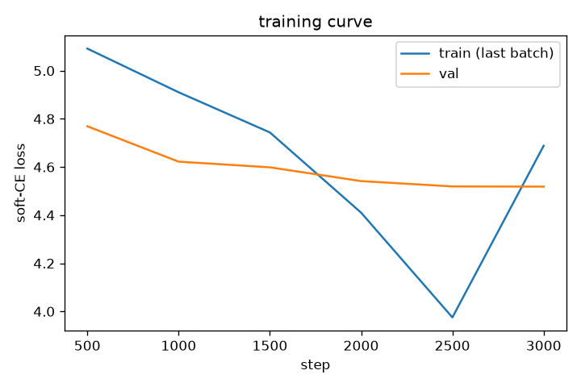
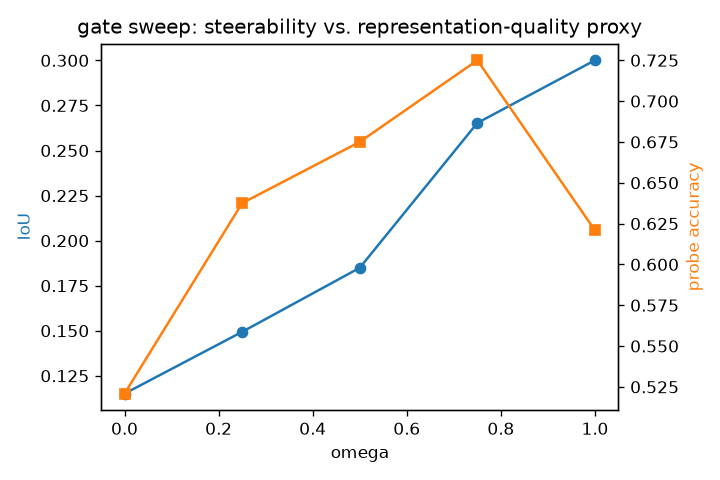
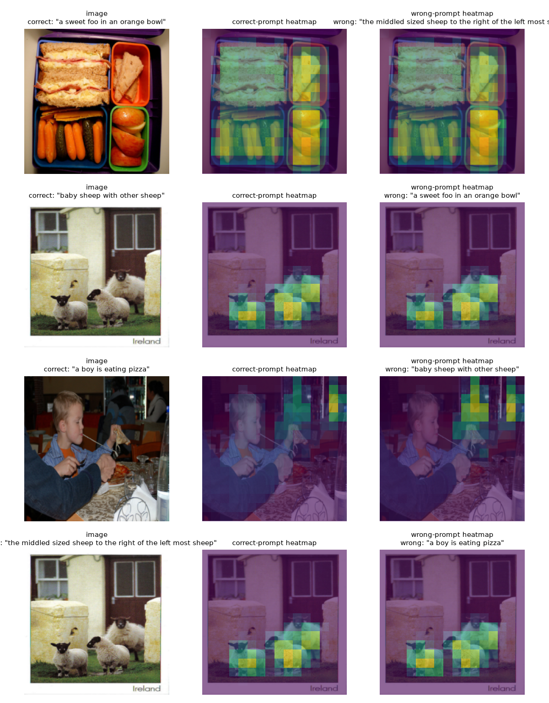

# SteerViT small-scale reproduction -- results
Trainable params: 15,356,167 | train images: 4500 | val images: 400

Run config: 224px input -> 16x16 = 256 patch grid | 3000 steps | batch 12 | device mps | autocast torch.bfloat16

> **Deviation from spec:** the spec calls for 336px -> 24x24 = 576 patches; this run used 224px -> 16x16 = 256 patches for speed. Localization metrics are correspondingly coarser (each patch covers a larger image area) and are NOT directly comparable to the paper's numbers. The mechanism checks -- especially wrong-prompt collapse -- are unaffected.

> **Note:** 3000 training steps, below the spec's 20-50k range, per the spec's guidance to stop once steering emerges/plateaus.

## 1-3. Baseline / Steerability / Wrong-prompt sanity check
| condition | patch-grid IoU | PR-AUC |
|---|---|---|
| baseline (frozen, no text) | 0.1151 | 0.2093 |
| steerability (correct prompt) | 0.3001 | 0.5135 |
| wrong prompt (mismatched) | 0.2649 | 0.4566 |

collapse_ratio = **0.810** (FAIL -- looks like memorization)

## 4. Gate (omega) sweep
| omega | IoU | PR-AUC | CLS linear-probe acc |
|---|---|---|---|
| 0.00 | 0.1151 | 0.2093 | 0.5208 |
| 0.25 | 0.1494 | 0.2660 | 0.6375 |
| 0.50 | 0.1849 | 0.3292 | 0.6750 |
| 0.75 | 0.2653 | 0.4565 | 0.7250 |
| 1.00 | 0.3001 | 0.5135 | 0.6208 |

omega=0 verified to reproduce frozen DINOv2 exactly (see sanity check above).

## Visualizations

